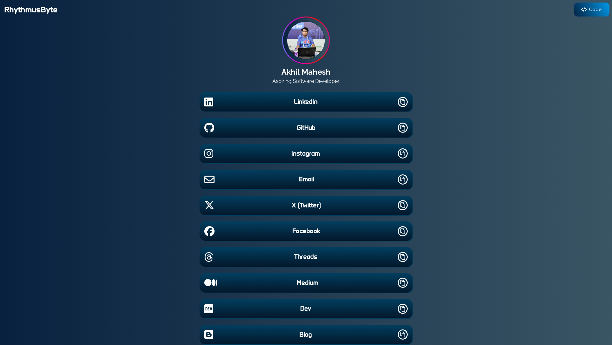

## Description
This repository contains the source code of a simple and elegant link tree website, created using HTML, CSS and JavaScript. 
> This repository, entirely written using an Android device.

---

## Linktree 

 
 

## Contribution
Contributions to the repository are welcome! If you have any suggestions, improvements, or bug fixes, feel free to open an issue or submit a pull request. I appreciate any feedback and help in making my personal website better.

> If you appreciate this repository, please consider giving it a star to show your support.
